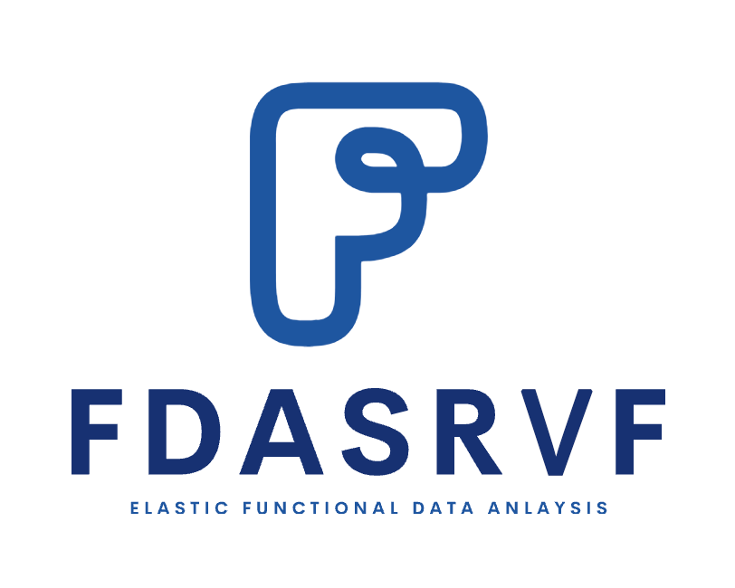

<!-- README.md is generated from README.Rmd. Please edit that file -->



<!-- badges: start -->

[](https://github.com/jdtuck/fdasrvf_R/actions/workflows/check-standard.yaml)
[](https://github.com/jdtuck/fdasrvf_R/actions/workflows/test-coverage.yaml)
[](https://app.codecov.io/gh/jdtuck/fdasrvf_R?branch=master)
[](https://CRAN.R-project.org/package=fdasrvf)
<!-- badges: end -->

A R package for functional data analysis using the square root velocity
framework which performs pair-wise and group-wise alignment as well as
modeling using functional component analysis

## Installation

v2.3.2 is on [CRAN](https://cran.r-project.org/package=fdasrvf) and can
be installed as

``` r
install.packages("fdasrvf")`
```

For a more up to date, but may not be stable version from git
repository.

1.  Download zip or tar.gz of package or clone repository
2.  Install into R (\> 4.3.0)

``` r
library(devtools)
install_github("jdtuck/fdasrvf_R")
```

## Example

The package contains `simu` dataset that is handy to experiment with the
available functions for functions in $\mathbb{R}^1$.

We first visualize this dataset:

For that we first turn on class of functions present in the `f` for
visualization:

``` r
library(fdasrvf)

f_plot(simu_data$time, simu_data$f)
```

 We can
see that each `curve` is a functionally closed 2D curve. And we
distinguish different patterns of miss-alignment, like X values
shrinking, small displacement, and many others.

We will now proceed with curve alignment for the curves of this class 1:

``` r
obj <- time_warping(simu_data$f, simu_data$time)
#> ℹ Using lambda = 0
#> ℹ Initializing...
#> ℹ Computing Karcher mean of 21 functions in SRSF space...
#> ℹ Entering iteration 1...
```

Let’s plot the result

``` r
plot(obj)
```


## References

Tucker, J. D. 2014, Functional Component Analysis and Regression using
Elastic Methods. Ph.D. Thesis, Florida State University.

Robinson, D. T. 2012, Function Data Analysis and Partial Shape Matching
in the Square Root Velocity Framework. Ph.D. Thesis, Florida State
University.

Huang, W. 2014, Optimization Algorithms on Riemannian Manifolds with
Applications. Ph.D. Thesis, Florida State University.

Srivastava, A., Wu, W., Kurtek, S., Klassen, E. and Marron, J. S.
(2011). Registration of Functional Data Using Fisher-Rao Metric.
arXiv:1103.3817v2.

Tucker, J. D., Wu, W. and Srivastava, A. (2013). Generative models for
functional data using phase and amplitude separation. Computational
Statistics and Data Analysis 61, 50-66.

J. D. Tucker, W. Wu, and A. Srivastava, “Phase-Amplitude Separation of
Proteomics Data Using Extended Fisher-Rao Metric,” Electronic Journal of
Statistics, Vol 8, no. 2. pp 1724-1733, 2014.

J. D. Tucker, W. Wu, and A. Srivastava, “Analysis of signals under
compositional noise With applications to SONAR data,” IEEE Journal of
Oceanic Engineering, Vol 29, no. 2. pp 318-330, Apr 2014.

Srivastava, A., Klassen, E., Joshi, S., Jermyn, I., (2011). Shape
analysis of elastic curves in euclidean spaces. Pattern Analysis and
Machine Intelligence, IEEE Transactions on 33 (7), 1415-1428.

S. Kurtek, A. Srivastava, and W. Wu. Signal estimation under random
time-warpings and nonlinear signal alignment. In Proceedings of Neural
Information Processing Systems (NIPS), 2011.

Kurtek, S., Srivastava, A., Klassen, E., and Ding, Z. (2012),
“Statistical Modeling of Curves Using Shapes and Related Features,”
Journal of the American Statistical Association, 107, 1152–1165.

Wen Huang, Kyle A. Gallivan, Anuj Srivastava, Pierre-Antoine Absil.
“Riemannian Optimization for Elastic Shape Analysis”, Short version, The
21st International Symposium on Mathematical Theory of Networks and
Systems (MTNS 2014).

Cheng, W., Dryden, I. L., and Huang, X. (2016). Bayesian registration of
functions and curves. Bayesian Analysis, 11(2), 447-475.

W. Xie, S. Kurtek, K. Bharath, and Y. Sun, A geometric approach to
visualization of variability in functional data, Journal of American
Statistical Association 112 (2017), pp. 979-993.

Lu, Y., R. Herbei, and S. Kurtek, 2017: Bayesian registration of
functions with a Gaussian process prior. Journal of Computational and
Graphical Statistics, 26, no. 4, 894–904.

Lee, S. and S. Jung, 2017: Combined analysis of amplitude and phase
variations in functional data. arXiv:1603.01775, 1–21.

J. D. Tucker, J. R. Lewis, and A. Srivastava, “Elastic Functional
Principal Component Regression,” Statistical Analysis and Data Mining,
vol. 12, no. 2, pp. 101-115, 2019.

J. D. Tucker, J. R. Lewis, C. King, and S. Kurtek, “A Geometric Approach
for Computing Tolerance Bounds for Elastic Functional Data,” Journal of
Applied Statistics, 10.1080/02664763.2019.1645818, 2019.

T. Harris, J. D. Tucker, B. Li, and L. Shand, “Elastic depths for
detecting shape anomalies in functional data,” Technometrics,
10.1080/00401706.2020.1811156, 2020.

Q. Xie, S. Kurtek, E. Klassen, G. E. Christensen and A. Srivastava.
Metric-based pairwise and multiple image registration. IEEE European
Conference on Computer Vision (ECCV), September, 2014

X. Zhang, S. Kurtek, O. Chkrebtii, and J. D. Tucker, “Elastic kkk-means
clustering of functional data for posterior exploration, with an
application to inference on acute respiratory infection dynamics”,
arXiv:2011.12397 \[stat.ME\], 2020 arxiv

J. D. Tucker and D. Yarger, “Elastic Functional Changepoint Detection of
Climate Impacts from Localized Sources”, Envirometrics,
10.1002/env.2826, 2023.
